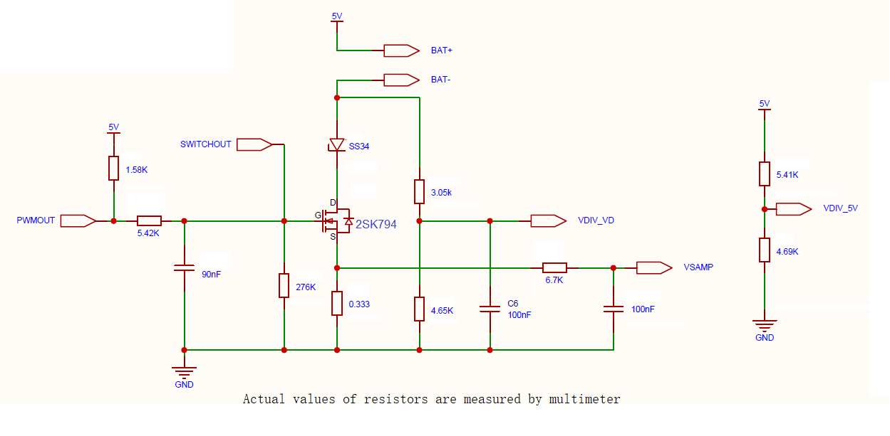

# small-battery-charger

Charges small single-cell batteries with custom configuration and monitoring.

**WARNING**: This is currently an initial draft.

## Prototype based on STM32F103C6T6 Blue Pill

Actually, STM32F103C8 would be better because its flash is able to store more debug information, but STM32F103C6 is cheaper.

### Circuit



MCU Pin Name | Used Name | IO Mode | Configured Function | Note
---|---|---|---|---
PA8 | PWMOUT | Open-drain output | TIM1_CH1 | TIM1_REMAP[1:0] = 00
PA9 | SWITCHOUT | Open-drain output | GPIO
PA1 | VDIV_5V | Analog input | ADC12_IN1 | Actual voltage of 5V * 0.4643
PA3 | VDIV_VD | Analog input | ADC12_IN3 |
PA5 | VSAMP | Analog input | ADC12_IN5 |

### Firmware

Currently the only firmware implementation is built for STM32F103C6; building it requires the Rust toolchain and `probe-rs`.

Connect the debug probe to the bluepill's SWD interface and execute:

```
cargo run -r
```

### Usage

Currently the only usage is to connect the bluepill to the PC via USB, and control the circuit with the VB program provided here.

## TODO

- Add temperature monitoring, and probably more protection in the circuit;
- Have a better PC-side controller utility;
- The low level protocol of controling charging current and monitoring battery voltage and current is already here; the trait could be defined in a seperate crate (?). An implementer of the trait should make sure that a non-zero constant current adjustment value should not cause the actual current to increase suddenly, especially when the control loop of the PC-side program stucks.
- Make a module based on `embassy-stm32` that makes use of ADC, TIM and DMA for oversampling (or soft filtering) by averaging multiple sampling values, instead of costing an `async` invocation for every sampling.
- Support some BLE-based hardware and have a corresponding mobile app;
- Simple offline panel to be operated without a PC or phone (?).
